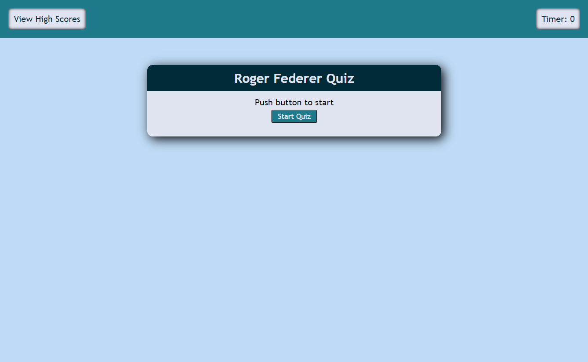
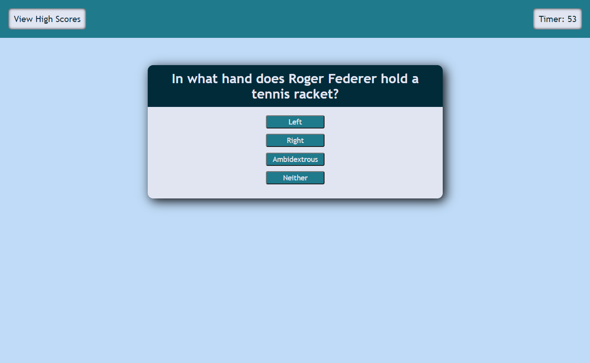
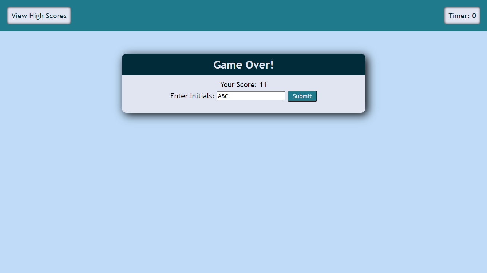
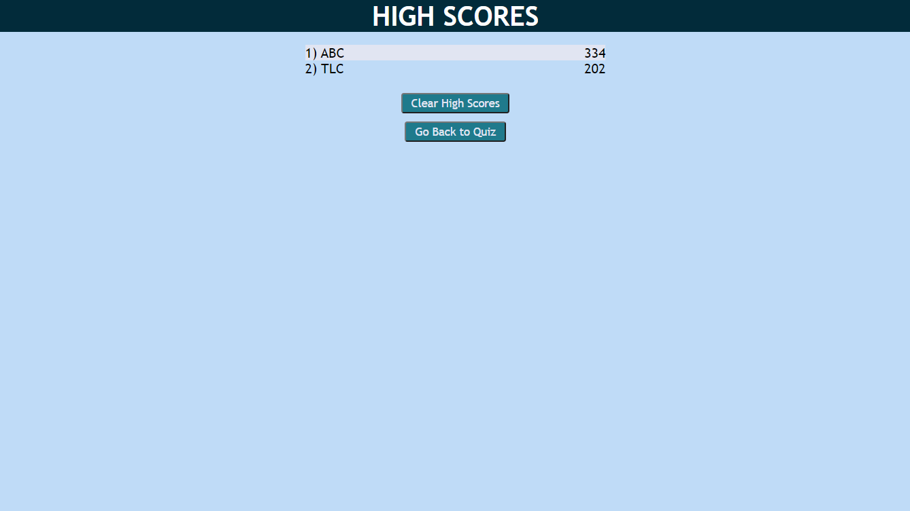

# Roger Federer Timed Quiz 

Deployed application: https://adriancronin.github.io/Quiz-Game/

## Description
A timed quiz featuring questions about professional tennis player Roger Federer. For every correct answer the time left will be added to the score. For every incorrect answer time will be removed. The game ends when time runs out or all the questions have been answered. The user is given the option to record their score on the High Scores page.

* I built this to bring together all the skills I've gained so far (HTML, Javascript, and CSS) into one project.

* I learned a lot in this project. I learned how to use multiple Javascript and HTML files in conjunction with each other. I learned how to make the application take user input in a variety of ways: text forms, buttons, ect, then save that data to local storage so it can be accessed after the browser closes or navigates to another page. I also gained much more understanding when it comes to generating HTML with Javascript

## Usage
Start Screen

Question with answer buttons

Game over / submit score screen

High Score page
